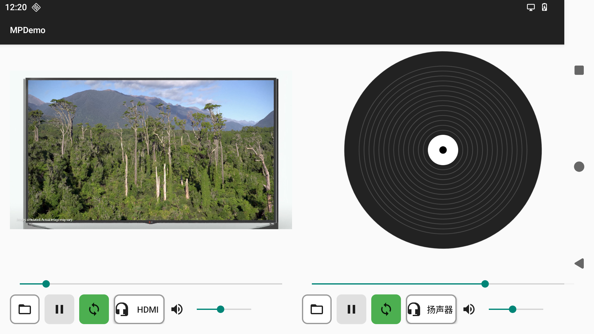

# MPDemo 应用说明文档

## 概述

MPDemo是一个Android多媒体演示应用程序，支持双路独立播放器，可以分别播放音频和视频文件。该应用特别设计用于测试和演示多媒体播放功能，包括输出设备选择、循环播放、播放控制等功能。

## 功能特性

### 双路独立播放器
- **Player 1** 和 **Player 2** 两个独立的播放器
- 每个播放器都有独立的控制按钮、进度条和音量控制
- 支持音频和视频文件播放

### 文件选择功能
- 支持从系统文件管理器中选择媒体文件
- 自动检测文件类型（音频/视频）
- 支持多种格式的媒体文件

### 输出设备控制
- 可以为每个播放器独立选择音频输出设备
- 支持蓝牙设备、USB音频设备等多种输出设备
- 在Android M及以上版本支持setPreferredDevice API

### 播放控制
- 播放/暂停功能
- 进度条拖动控制
- 音量调节(MediaPlayer setVolume)
- 循环播放开关

## 界面

左侧播放视频，从hdmi out输出；右侧播放mp3，从扬声器输出。

